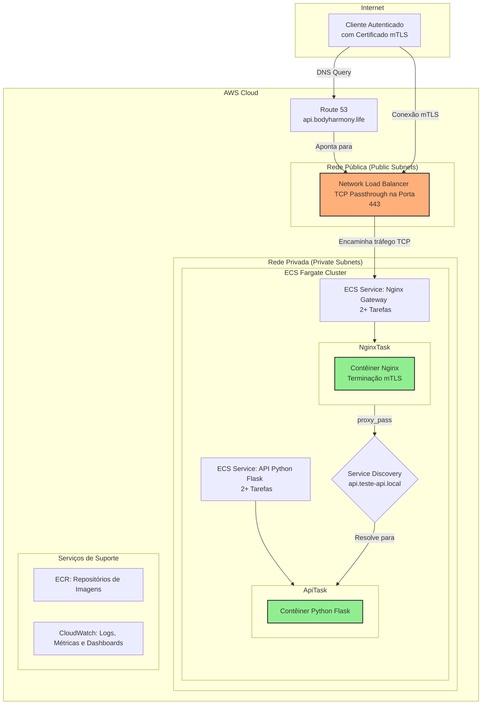

# Documentação Técnica: API Segura com mTLS em AWS ECS Fargate

## Tabela de Conteúdo

1.  [📜 Visão Geral](#1--visão-geral)
2.  [🏛️ Arquitetura de Referência](#2-️-arquitetura-de-referência)
3.  [🚀 Provisionamento da Infraestrutura (IaC)](#3--provisionamento-da-infraestrutura-iac)
4.  [🔄 Pipeline de Deploy (CI/CD)](#4--pipeline-de-deploy-cicd)
5.  [🛡️ Postura de Segurança (DevSecOps)](#5-️-postura-de-segurança-devsecops)
6.  [📊 Monitoramento e Observabilidade](#6--monitoramento-e-observabilidade)
7.  [✅ Testes e Validação](#7--testes-e-validação)
8.  [🆘 Guia de Troubleshooting](#8--guia-de-troubleshooting)
9.  [📞 Contato](#9--contato)

---

## 1. 📜 Visão Geral

Este documento detalha a arquitetura e implementação de uma API Python Flask segura, provisionada na AWS. A solução foi projetada para ser robusta, escalável e segura, utilizando **Amazon ECS (Elastic Container Service)** com **Fargate** e impondo autenticação mútua via **mTLS (Mutual TLS)**.

-   **Objetivo Estratégico:** Automatizar o provisionamento de uma arquitetura cloud-native resiliente, que garanta a autenticidade de clientes e servidor por meio de certificados digitais, seguindo as melhores práticas de DevSecOps.
-   **Caso de Uso:** Ideal para APIs e microsserviços que demandam um alto nível de segurança, como sistemas financeiros (Open Banking), saúde (HealthTech) ou qualquer aplicação que processe dados sensíveis.

### Stack Tecnológico Principal

| Categoria             | Tecnologia                                    | Justificativa                                                 |
| --------------------- | --------------------------------------------- | ------------------------------------------------------------- |
| **Cloud Provider**    | AWS                                           | Ecossistema de serviços gerenciados e maduros.                |
| **Orquestração**      | ECS Fargate                                   | Plataforma serverless para contêineres, abstrai infraestrutura. |
| **Load Balancer**     | Network Load Balancer (NLB)                   | Performance (Camada 4) e suporte a TCP Passthrough para mTLS. |
| **API Gateway**       | Nginx com mTLS                                | Gateway para terminação mTLS e proxy reverso.                 |
| **Service Discovery** | AWS Cloud Map                                 | Resolução de DNS interna e dinâmica para os serviços.         |
| **IaC**               | Terraform & AWS CDK                           | Duas implementações para flexibilidade de provisionamento.      |
| **CI/CD**             | GitHub Actions                                | Automação de build, teste e deploy.                           |
| **Monitoramento**     | Amazon CloudWatch                             | Logs, métricas, dashboards e alertas centralizados.           |
| **Segurança**         | WAF v2, Security Groups, IAM Roles, mTLS      | Múltiplas camadas de segurança (defense-in-depth).            |

---

## 2. 🏛️ Arquitetura de Referência

A arquitetura foi desenhada com base nos princípios de segurança em camadas (defense-in-depth) e menor privilégio (least privilege), respeitando os requisitos pré-definidos para a solução.

### Requisitos Obrigatórios

Os seguintes componentes foram definidos como mandatórios para a implementação:

-   **Orquestrador de Contêineres:** AWS ECS Fargate
-   **Exposição Pública:** Um Load Balancer público
-   **Gateway de Segurança:** Nginx com terminação mTLS
-   **Pipeline de CI/CD:** GitHub Actions
-   **Aplicação:** API em Python Flask

### Diagrama da Arquitetura



### Decisões de Implementação Chave

Com os requisitos acima estabelecidos, as seguintes decisões técnicas foram tomadas para construir a solução.

#### Network Load Balancer (NLB) vs. Application Load Balancer (ALB)

A escolha do tipo de Load Balancer foi uma decisão crítica para a viabilidade do mTLS. **Inicialmente, um Application Load Balancer (ALB) foi implementado, mas foi substituído por um Network Load Balancer (NLB) durante a fase de troubleshooting.** A razão para esta mudança é fundamental para o entendimento da arquitetura.

-   **Problema com ALB:** Um ALB opera na camada 7 e **termina a conexão TLS** do cliente para inspecionar o tráfego HTTP. Ao fazer isso, o certificado original do cliente não é repassado ao Nginx, quebrando a cadeia de confiança e tornando a validação mTLS impossível.
-   **Solução com NLB:** O NLB opera na camada 4 e utiliza o modo **TCP Passthrough**. Ele encaminha o tráfego TLS criptografado diretamente para o Nginx sem inspecioná-lo. Isso preserva a conexão de ponta a ponta e permite que o Nginx realize a validação do certificado do cliente, cumprindo o requisito de segurança.

**Implementação da Validação Granular no Nginx:**

Para atender ao requisito de ter um endpoint público (`/health`) e proteger o restante da API, foi utilizada a diretiva `ssl_verify_client optional` no Nginx. Isso permite que a verificação do certificado seja feita de forma condicional dentro dos blocos `location`.

```nginx
# A verificação é definida como opcional no nível do servidor.
ssl_verify_client optional;
ssl_client_certificate /etc/nginx/certs/ca.crt;

# O endpoint de health check é público e não verifica o certificado.
location /health {
    return 200 "OK";
}

# O restante da API exige um certificado válido.
location / {
    # Se a verificação do certificado não for "SUCCESS", a requisição é bloqueada.
    if ($ssl_client_verify != "SUCCESS") {
        return 403;
    }
    proxy_pass http://api.minha-api.local:5000;
}
```

#### Geração de Certificados com Script (Self-Signed CA)

Para a implementação do mTLS, foi necessário criar uma autoridade certificadora (CA) e emitir certificados para o servidor (Nginx) e para o cliente.

-   **Abordagem Escolhida:** Foi utilizado um script shell (`gerar_certificados.sh`) com OpenSSL para criar uma CA privada (autoassinada) e gerar todos os certificados necessários.
-   **Justificativa:** Para o escopo deste projeto (um desafio técnico e ambiente de desenvolvimento), esta abordagem é:
    -   **Autossuficiente:** Não depende de serviços externos ou custos adicionais.
    -   **Rápida e Simples:** Permite gerar e regenerar certificados para teste de forma imediata.
    -   **Controlada:** Oferece controle total sobre os parâmetros dos certificados gerados.

-   **Recomendação para Produção:** Em um ambiente de produção real, o uso de uma CA autoassinada gerenciada por scripts não é recomendado. A abordagem ideal seria utilizar uma solução de Public Key Infrastructure (PKI) gerenciada, como o **AWS Certificate Manager Private CA** ou **HashiCorp Vault**. Esses serviços oferecem maior segurança, automação na rotação de certificados, trilhas de auditoria e gerenciamento de ciclo de vida, que são essenciais para a segurança em escala.

#### Service Discovery com AWS Cloud Map

Para permitir que o serviço Nginx encontre e se comunique de forma confiável com as instâncias do serviço da API (que possuem IPs dinâmicos), foi implementado o AWS Cloud Map.

-   **Justificativa da Escolha:**
    -   **Resolução de DNS Dinâmica:** O Cloud Map cria um registro DNS interno (ex: `api.minha-api.local`) que é automaticamente atualizado com os IPs das tarefas saudáveis da API. Isso elimina a necessidade de gerenciamento manual de IPs.
    -   **Integração Nativa com ECS:** O ECS registra e desregistra automaticamente as tarefas no Cloud Map conforme elas são criadas ou destruídas, garantindo que a lista de endpoints esteja sempre atualizada.
    -   **Resiliência:** Em conjunto com os health checks do ECS, o Cloud Map garante que o tráfego seja roteado apenas para as instâncias saudáveis, aumentando a resiliência da aplicação.

### Fluxo de Requisição

1.  **Conexão do Cliente:** O cliente, de posse de um certificado digital válido, inicia uma conexão TLS com o **Network Load Balancer (NLB)** na porta 443.
2.  **TCP Passthrough:** O NLB opera na camada 4 (transporte) e não inspeciona o tráfego TLS. Ele simplesmente encaminha os pacotes TCP para uma das tarefas do serviço Nginx que estão na rede privada.
3.  **Terminação mTLS no Nginx:** O contêiner Nginx recebe o tráfego. Ele está configurado para realizar o handshake mTLS, validando o certificado do cliente contra uma CA (Certificate Authority) confiável.
4.  **Validação e Proxy:**
    -   Se o certificado do cliente for válido (`$ssl_client_verify = "SUCCESS"`), o Nginx atua como proxy reverso, encaminhando a requisição HTTP para o serviço da API.
    -   Se o certificado for inválido ou ausente, o Nginx retorna um código `403 Forbidden`, bloqueando o acesso.
5.  **Service Discovery:** O Nginx utiliza o **AWS Cloud Map** para resolver o endereço IP interno e atual das tarefas da API (`api.teste-api.local`), garantindo uma comunicação resiliente.
6.  **Processamento na API:** A tarefa da API recebe a requisição, processa e retorna a resposta através do mesmo fluxo.

---

## 3. 🚀 Provisionamento da Infraestrutura (IaC)

A infraestrutura é inteiramente gerenciada como código, oferecendo duas implementações funcionalmente equivalentes para máxima flexibilidade.

### Estrutura de Diretórios

```
devops-interview/
├── terraform/                # Implementação IaC com Terraform
├── cdk/                      # Implementação IaC com AWS CDK
├── nginx/                    # Imagem e configurações do Nginx Gateway
├── api/                      # Imagem e código da API Flask
├── scripts/                  # Scripts de deploy manual
└── .github/workflows/        # Pipeline de CI/CD com GitHub Actions
```

### Opção 1: Terraform (Implementação Padrão)

Localizado em `terraform/`. Utiliza HCL, uma linguagem declarativa para provisionamento multi-cloud.

**Passos para o Deploy:**

```bash
# 1. Navegue até o diretório do Terraform
cd terraform

# 2. Inicialize os providers e o backend
terraform init

# 3. (Opcional) Planeje e revise as mudanças
terraform plan

# 4. Aplique a infraestrutura
terraform apply --auto-approve
```

### Opção 2: AWS CDK (Implementação Alternativa)

Localizado em `cdk/`. Utiliza TypeScript para definir a infraestrutura de forma programática, aproveitando a tipagem forte e a lógica de uma linguagem de programação completa.

**Passos para o Deploy:**

```bash
# 1. Navegue até o diretório do CDK e instale as dependências
cd cdk
npm install

# 2. (Primeira vez) Realize o bootstrap do ambiente CDK
cdk bootstrap

# 3. Faça o deploy da stack
cdk deploy --require-approval never
```

---

## 4. 🔄 Pipeline de Deploy (CI/CD)

O deploy das aplicações é totalmente automatizado através de um pipeline de CI/CD com GitHub Actions, que é o método padrão e exclusivo para esta arquitetura.

### Pipeline GitHub Actions

O pipeline de integração e entrega contínua é orquestrado pelo **GitHub Actions**, localizado em `.github/workflows/deploy.yml`.

**Gatilho:** O pipeline é acionado automaticamente a cada `push` na branch `main`.

**Processo do Pipeline:**

1.  **Autenticação Segura (OIDC):** O runner se autentica na AWS de forma segura usando OpenID Connect, obtendo credenciais temporárias.
2.  **Leitura da Infraestrutura:** O Terraform é utilizado para ler os outputs da infraestrutura existente (nomes de cluster, ECR, etc.), evitando a necessidade de hardcoding.
3.  **Build & Push das Imagens:** As imagens Docker da API e do Nginx são construídas, tagueadas com o SHA do commit e a tag `latest`, e enviadas para o Amazon ECR.
4.  **Force New Deployment:** O pipeline força um novo deploy nos serviços ECS, que irão baixar as novas imagens e substituir as tarefas antigas em um processo de rolling update.

---

## 5. 🛡️ Postura de Segurança (DevSecOps)

A segurança é um pilar fundamental desta arquitetura, integrada em múltiplas camadas.

### Autenticação Mútua (mTLS)

-   **Implementação:** O mTLS é imposto pelo Gateway Nginx. A configuração `ssl_verify_client optional` no `nginx.conf` permite que a verificação seja condicionada dentro de um bloco `location`, possibilitando a exposição de endpoints públicos (como `/health`) que não exigem certificado, enquanto o restante da API é protegido.
-   **Geração de Certificados:** O script `nginx/certs/gerar_certificados.sh` cria uma CA (Certificate Authority) privada e emite certificados de servidor e cliente. É crucial que o `COMMON_NAME` do certificado do servidor corresponda ao DNS do NLB.

### Segurança de Rede (Zero Trust)

-   **Isolamento de Rede:** A arquitetura utiliza uma VPC com sub-redes públicas (para o NLB) e privadas (para as tarefas ECS). Os contêineres não possuem IP público e não são diretamente acessíveis pela internet.
-   **Security Groups como Firewall:** Regras de firewall stateful restringem o tráfego:
    -   **SG do Nginx:** Permite tráfego TCP na porta 443 apenas a partir da internet (`0.0.0.0/0`), para ser acessível pelo NLB.
    -   **SG da API:** Permite tráfego TCP na porta 5000 **apenas** a partir do Security Group do Nginx. Qualquer outra tentativa de acesso é bloqueada.

### Web Application Firewall (WAF)

-   **Status Atual:** Os recursos do `AWS WAFv2` são provisionados, mas **não estão associados ao NLB**.
-   **Limitação Importante:** O AWS WAF opera na camada 7 (HTTP) e, por isso, **não pode ser associado a Network Load Balancers**, que operam na camada 4 (TCP).
-   **Recomendação:** Se a proteção do WAF for um requisito mandatório (para inspeção de SQL Injection, XSS, etc.), a arquitetura deve ser modificada para utilizar um **Application Load Balancer (ALB)**.

### Gestão de Identidade e Acesso (IAM)

-   **Princípio do Menor Privilégio:** A `ecs_task_execution_role` concede apenas as permissões essenciais para que o ECS Agent possa puxar imagens do ECR e enviar logs para o CloudWatch. Nenhuma permissão adicional é concedida por padrão.

### Análise de Vulnerabilidades de Imagens

-   **ECR Scan on Push:** Esta funcionalidade está habilitada nos repositórios ECR. A cada `docker push`, o ECR analisa a imagem em busca de vulnerabilidades conhecidas (CVEs), fornecendo um relatório de segurança que pode ser integrado ao pipeline de CI/CD para bloquear deploys de imagens vulneráveis.

---

## 6. 📊 Monitoramento e Observabilidade

A observabilidade é garantida por meio da integração nativa com o Amazon CloudWatch.

### CloudWatch Dashboards

Um dashboard customizado (`teste-api-dashboard-prod`) é provisionado automaticamente via IaC. Ele centraliza as métricas mais críticas, permitindo uma visão unificada da saúde do sistema:
-   **Métricas do NLB:** `ActiveFlowCount`, `HealthyHostCount`, `NewFlowCount`.
-   **Métricas dos Serviços ECS:** `CPUUtilization`, `MemoryUtilization`, `RunningTaskCount`.
-   **Métricas do WAF:** `AllowedRequests`, `BlockedRequests` (quando aplicável).

### CloudWatch Logs

Todos os logs (`stdout`/`stderr`) dos contêineres são enviados para grupos de logs dedicados, permitindo análise e troubleshooting:
-   **Logs do Nginx (`/ecs/teste-api/nginx`):** Contêm logs de acesso, erros e, crucialmente, o status da verificação do certificado cliente (`$ssl_client_verify`).
-   **Logs da API (`/ecs/teste-api/api`):** Logs da aplicação Flask, incluindo requisições recebidas e stack traces de erros.

**Comando útil para logs em tempo real:**
```bash
# Acompanhe os logs de ambos os serviços simultaneamente
aws logs tail /ecs/teste-api/nginx /ecs/teste-api/api --follow
```

### Health Checks

A saúde da aplicação é monitorada em duas camadas:
1.  **NLB Target Group:** Verifica o endpoint `/health` na porta 443 do Nginx a cada 30 segundos. Se um target falhar, o NLB para de enviar tráfego para ele.
2.  **ECS Service:** O próprio ECS monitora a saúde do contêiner. Se um contêiner falhar no seu health check, o ECS o substituirá automaticamente por uma nova instância.

---

## 7. ✅ Testes e Validação

A validação da implementação pode ser feita com os seguintes comandos `curl`.

### Checklist de Validação

-   [x] **Teste 1: Health Check (Público)**
    -   **Comando:** `curl -k https://api.bodyharmony.life/health`
    -   **Resultado Esperado:** `200 OK`

-   [x] **Teste 2: Acesso à API sem Certificado**
    -   **Comando:** `curl -k https://api.bodyharmony.life/api/webhook`
    -   **Resultado Esperado:** `403 Forbidden`

-   [x] **Teste 3: Acesso à API com Certificado Válido**
    -   **Comando:** `curl -k --cert ./cliente.crt --key ./cliente.key https://api.bodyharmony.life/api/webhook -H "Content-Type: application/json" -d '{"test": "data"}'`
    -   **Resultado Esperado:** `200 OK` com o corpo da resposta da API.

---

## 8. 🆘 Guia de Troubleshooting

### Problemas Comuns e Soluções

| Sintoma                                      | Causa Provável                                            | Diagnóstico / Solução                                                                                                                              |
| -------------------------------------------- | --------------------------------------------------------- | -------------------------------------------------------------------------------------------------------------------------------------------------- |
| **`403 Forbidden` no `/health`**             | Erro na configuração do Nginx, exigindo mTLS no health check. | Verifique o `nginx.conf`. O bloco `location /health` não deve conter a diretiva `if ($ssl_client_verify != "SUCCESS")`.                  |
| **`502 Bad Gateway`**                          | Nginx não consegue se conectar à API.                       | **1.** Verifique os logs da API em CloudWatch. <br> **2.** Confirme se as tarefas da API estão saudáveis no ECS. <br> **3.** Verifique o Service Discovery. |
| **`504 Gateway Timeout`**                      | A API não responde a tempo.                               | **1.** Verifique os logs da API por processamento lento. <br> **2.** Aumente os timeouts no `nginx.conf` (`proxy_read_timeout`).               |
| **Erro de Handshake SSL** (`bad certificate`) | Certificado do cliente inválido, expirado ou não confiável. | **1.** Verifique a validade do certificado (`openssl x509`). <br> **2.** Garanta que o certificado foi assinado pela mesma CA usada no Nginx. <br> **3.** Regenere os certificados. |
| **Falha no Build do Docker** (`failed to solve`) | Problema no ambiente local do Docker. | **1.** Verifique se o Docker Desktop está em execução. <br> **2.** Considere limpar o cache com `docker system prune -a`. |

### Comandos de Debug Essenciais

```bash
# Descrever o estado dos serviços ECS
aws ecs describe-services --cluster teste-api-cluster --services teste-api-nginx teste-api-api

# Verificar a saúde dos targets do NLB
# (Substitua o ARN pelo valor real do seu Target Group)
aws elbv2 describe-target-health --target-group-arn [SEU_TARGET_GROUP_ARN]

# Testar conexão SSL e ver certificado do servidor
openssl s_client -connect api.bodyharmony.life:443 -servername api.bodyharmony.life

# Filtrar logs do Nginx por erros
aws logs filter-log-events --log-group-name "/ecs/teste-api/nginx" --filter-pattern "ERROR"
```

---

## 9. 📞 Contato

-   **Nome**: Fidêncio Vieira
-   **Email**: juniorx1xd@gmail.com